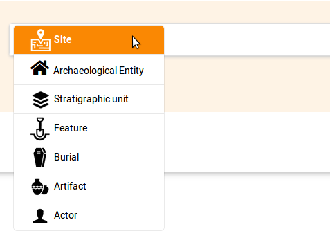
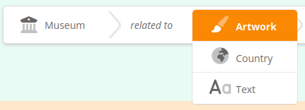
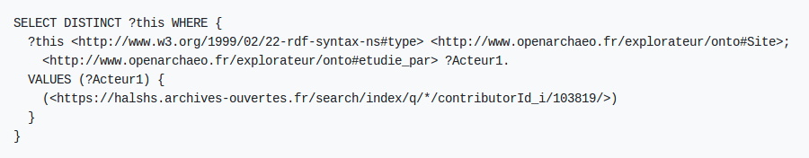
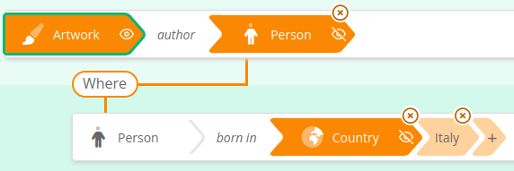
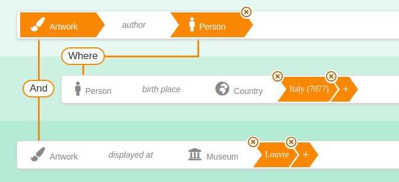

# SimSemSearch - Simple Semantic Search

SimSemSearch is a **visual SPARQL query builder written in javascript**.

It supports the creation of basic graph patterns with the selection of values with autocomplete search or dropdown lists. It can be configured through a JSON-LD ontology file that defines the classes and properties to be presented in the component.

# Getting Started

To get started :

1. Read the following documentation;
2. Look at how things work in file `index.html`; 
   1. **Attention** : make sure you open this open through a web server, e.g. http://localhost/simsemsearch/index.html, and *not* by opening the file directly in your browser (`file://...`), otherwise the loading of component specification fails and your will get a blank page;
3. Look at how the specification file is written under `config/spec-search.json`;

# Features

## Query Structure

### Basic query pattern

Select the type of entity to search...



... then select the type of the related entity.



In this case there is only one possible type of relation between the two "_studied by_", so it gets selected automatically. Then select a value for the related entity, in this case in a dropdown list :


Congratulations, your first SPARQL query criteria is complete !


Now you can fetch the generated SPARQL query :



### "where"

This enables to navigate the graph :



### "and"

Combine criterias :



### "or"

Select multiple values in a criteria

## Values selection

SimSemSearch offers currently 4 ways of selecting a value for a criteria : autocomplete field, dropdown list, simple string value, year range.

###Autocomplete field

### Dropdown list

### String value (text search)

### Year range

## Multilingual

SimSemSearch is multilingual and supports displaying labels of classes and properties in multiple languages.

## Limitations

### 3 level depth

SimSemSearch allows for the moment to navigate the graph at 3 levels deep using the "where" operator. The number of criterias that can be combined with "and" is not limited.

### Only basic graph patterns, no UNION, OPTIONAL, BIND, etc.

SimSemSearch produces only basic graph patterns with VALUES. It does not support the creation of UNION, OPTIONAL, SERVICE, BIND, etc...

# Integration

## Specification of classes and properties

The component is configurable using a JSON(-LD) ontology file. Look at the specification files under the `config` folder to get you an idea. The file contains :

### Class definition

```json
    {
      "@id" : "http://www.openarchaeo.fr/explorateur/onto#Site",
      "@type" : "Class",
      "label": [
        {
          "@value" : "Site",
          "@language" : "en"
        },
        {
          "@value" : "Site",
          "@language" : "fr"
        }
      ],
	  "iconPath":  "assets/icons/noir/site.png",
	  "highlightedIconPath":  "assets/icons/blanc/site.png"
    },
```

### Property definitions with domains and ranges

```json
    {
      "@id" : "http://www.openarchaeo.fr/explorateur/onto#trouve_dans",
      "@type" : "ObjectProperty",
      "label": [
        {
          "@value" : "found in",
          "@language" : "en"
        },
        {
          "@value" : "trouvé dans",
          "@language" : "fr"
        }
      ],
      "domain": "http://www.openarchaeo.fr/explorateur/onto#Mobilier",
      "range": {
        "@type" : "Class",
        "unionOf" : {
          "@list" : [ 
            { "@id" : "http://www.openarchaeo.fr/explorateur/onto#Site"},
            { "@id" : "http://www.openarchaeo.fr/explorateur/onto#US"},
            { "@id" : "http://www.openarchaeo.fr/explorateur/onto#Sepulture"}
          ]
        }
      },
      "widget": {
        "@type" : "http://ontologies.sparna.fr/SimSemSearch#AutocompleteWidget"
      }
    },
```

### Using font-awesome icons

It is possible to directly use font-awesome icons in place of icons embedded in your application :

```json
"iconPath":  "<span style='font-size: 170%;' >&nbsp;<i class='fas fa-user'></i></span>",
```

## How to integrate SimSemSearch in a webpage

Have a look at `index.html` to see how the component is integrated in a webpage.


