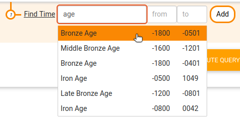

# Sparnatural SPARQL query builder
Sparnatural is a **visual SPARQL query builder written in Typescript**.

It supports the creation of basic graph patterns with the selection of values with autocomplete search or dropdown lists. It can be configured through a JSON-LD or OWL configuration file (that can be edited in Protégé) that defines the classes and properties to be presented in the component.


You can play with **online demos at http://sparnatural.eu#demos**.

# Getting Started

To get started :

1. Read the following README;
2. Read [the documentation](https://docs.sparnatural.eu)
3. Look at how things work in [sparnatural-demo-dbpedia](https://github.com/sparna-git/sparnatural.eu/tree/main/demos/demo-dbpedia); 
4. In particular look at how the specifications are written by looking at [the source of `sparnatural-demo-dbpedia/index.html`](https://github.com/sparna-git/sparnatural.eu/blob/main/demos/demo-dbpedia/index.html)
5. Adapt [`sparnatural-demo-dbpedia/index.html`](https://github.com/sparna-git/sparnatural.eu/blob/main/demos/demo-dbpedia/index.html) by changing the configuration and adapting the SPARQL endpoint URL;

# Features

## Query Structure

### Basic query pattern

Select the type of entity to search...


... then select the type of the related entity.


In this case there is only one possible type of relation that can connect the 2 entities, so it gets selected automatically. Then select a value for the related entity, in this case in a dropdown list :


Congratulations, your first SPARQL query criteria is complete !


Now you can fetch the generated SPARQL query :


### "WHERE"

This enables to navigate the graph :


### "AND"

Combine criterias :


### "OR"

Select multiple values for a criteria :


## Values selection

Sparnatural offers currently 6 ways of selecting a value for a criteria : autocomplete field, dropdown list, simple string value, date range (year or date precision), date range with a search in a period name (e.g. "bronze age"), or no selection at all.

### Autocomplete field


### Dropdown list


### Tree selector


### Map selector


### String value (text search)


### Date range (year or date precision)


### Date range with search in period name (chronocultural periods)



(this requires data from [Perio.do](https://perio.do), a gazeeter of periods for linking and visualizing data)

### Boolean selection


### No value selection

This is useful when a type a of entity is used only to navigate the graph, but without the ability to select an instance of these entities.


## Multilingual

Sparnatural is multilingual and supports displaying labels of classes and properties in multiple languages.

## Support for OPTIONAL and FILTER NOT EXISTS

Sparnatural supports the `OPTIONAL` and `FILTER NOT EXISTS {}` keywords applied to a whole "branch" of the query.
See here how to search for French Museums and the name of Italian painters they display, _if any_ :


## Support for SERVICE keyword

There is currently an experimental support for the SERVICE keyword for federated querying.

## Limitations

### No UNION or BIND, etc.

Sparnatural does not support the creation of UNION, BIND, etc...

### SPARQL endpoint needs to be CORS-enabled

To send SPARQL queries to a service that is not hosted on the same domain name as the web page in which Sparnatural is included, the SPARQL endpoint needs to allow [Cross-Origin Resource Sharing (CORS)](https://enable-cors.org/). But we have SPARQL proxies for those who are not, don't worry ;-)

# Integration

## Specification of classes and properties

The component is configurable using a an [OWL configuration file](https://docs.sparnatural.eu/OWL-based-configuration) editable in Protégé.. Look at the specification files of [the demos](https://github.com/sparna-git/sparnatural.eu/tree/main/demos) to get an idea. 

Alternatively one can also use a [JSON(-LD) ontology file](https://docs.sparnatural.eu/JSON-based-configuration). A JSON(-LD) configuration file contains :

### Class definition

```json
    {
      "@id" : "http://dbpedia.org/ontology/Museum",
      "@type" : "Class",
      "label": [
        {"@value" : "Museum", "@language" : "en"},
        {"@value" : "Musée","@language" : "fr"}
      ],
      "faIcon":  "fas fa-university"
    },
```

### Property definitions with domains and ranges

```json
    {
      "@id" : "http://dbpedia.org/ontology/museum",
      "@type" : "ObjectProperty",
      "subPropertyOf" : "sparnatural:AutocompleteProperty",
      "label": [
        {"@value" : "displayed at","@language" : "en"},
        {"@value" : "exposée à","@language" : "fr"}
      ],
      "domain": "http://dbpedia.org/ontology/Artwork",
      "range": "http://dbpedia.org/ontology/Museum",
      "datasource" : "datasources:search_rdfslabel_bifcontains"
    },
```

### Using font-awesome icons

It is possible to directly use font-awesome icons in place of icons embedded in your application :

```json
"faIcon":  "fas fa-user",
```

## How to integrate Sparnatural in a webpage

Look at [this page in the documentation](https://docs.sparnatural.eu/Javascript-integration).


## Map the query structure to a different graph structure

Map classes or properties in the config to a corresponding SPARQL property path or a corresponding class URI, using the `sparqlString` JSON key, e.g. :

```
    {
      "@id" : "http://labs.sparna.fr/sparnatural-demo-dbpedia/onto#bornIn",
      "@type" : "ObjectProperty",
      ...
      "sparqlString": "<http://dbpedia.org/ontology/birthPlace>/<http://dbpedia.org/ontology/country>",
    },
```

Then call `expandSparql` on the `sparnatural` instance by passing the original SPARQL query, to replace all mentions of original classes and properties URI with the corresponding SPARQL string :

```
queryString = sparnatural.expandSparql(queryString);
```
