# Sparnatural SPARQL query builder
Sparnatural is a **visual client-side SPARQL query builder** for exploring and navigating RDF Knowledge Graphs. It is written in Typescript.

It supports the creation of basic graph patterns with the selection of values with autocomplete search or dropdown lists, or other widgets. It can be configured through a SHACL configuration file that defines the classes and properties to be presented in the component.

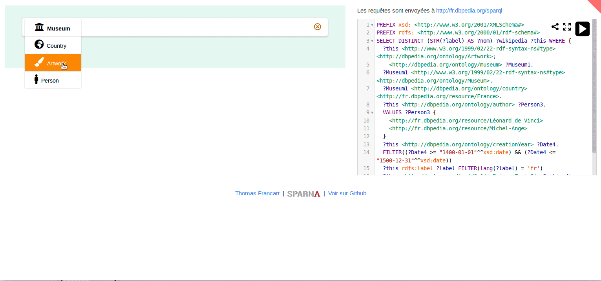

You can play with **online demos at http://sparnatural.eu#demos**.

# Getting Started

To get started :

1. Read the following README;
2. Have a look at the [online DBPedia demo](https://sparnatural.eu/demos/demo-dbpedia-en/)
3. Read [the documentation](https://docs.sparnatural.eu):
    - follow the [_Hello sparnatural tutorial_](https://docs.sparnatural.eu/hello-sparnatural/Hello-Sparnatural.html) to setup your environment
    - follow the [_SHACL configuration guide_](https://docs.sparnatural.eu/how-to-configure-shacl/How-to-configure-Sparnatural-shacl.html) to understand how the configuration can be expressed in SHACL
    - have a look at the [_technical integration documentation_](https://docs.sparnatural.eu/Javascript-integration.html) to understand how to integrate the webcomponent in your webpage

# Features

## Query Structure

### Basic query pattern

Select the type of entity to search...

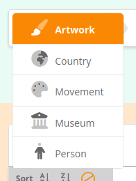

... then select the type of the related entity.


In this case there is only one possible type of relation that can connect the 2 entities, so it gets selected automatically. Then select a value for the related entity, in this case in a dropdown list :

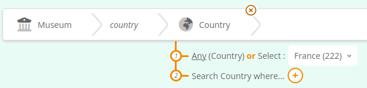

Congratulations, your first SPARQL query criteria is complete !


Now you can fetch the generated SPARQL query :


### "WHERE"

This enables to navigate the graph :


### "AND"

Combine criterias :

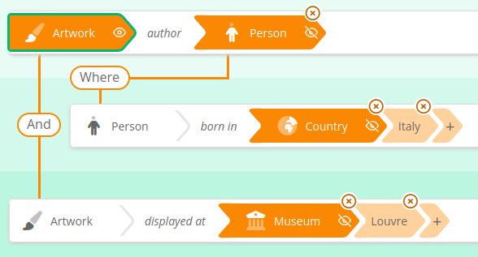

### "OR"

Select multiple values for a criteria :


(UNIONs are not supported)

## Values selection

Sparnatural offers currently 9 ways of selecting a value for a criteria :
- dropdown list widget
- autocomplete search field
- tree browsing widget
- map selection widget
- string search widget, searched as regex or as exact string
- date range widget (year or date precision)
- numeric values widget
- boolean widget
- no value selection (useful for 'intermediate' entities)

### Dropdown list widget

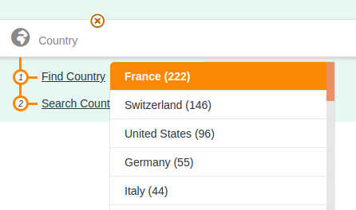

### Autocomplete search widget


### Tree browsing widget


### Map selection widget

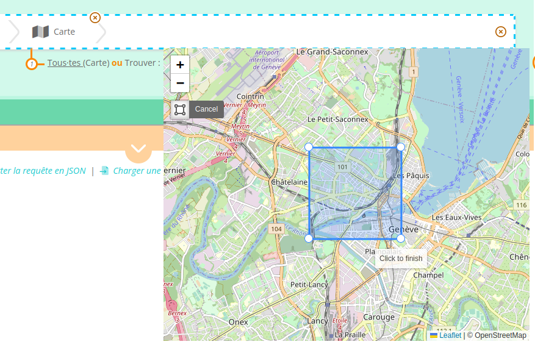

### String search widget (text search)

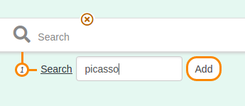

### Date range widget (year or date precision)

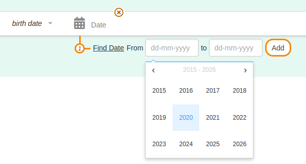

### Numeric values widget

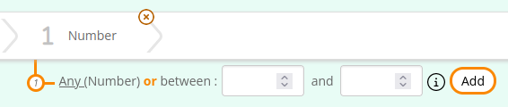

### Boolean widget

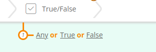

### No value selection

This is useful when a type a of entity is used only to navigate the graph, but without the ability to select an instance of these entities.

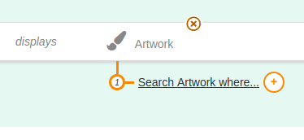

## Multilingual

Sparnatural is multilingual and supports displaying labels of classes and properties in multiple languages.

## Support for OPTIONAL and FILTER NOT EXISTS

Sparnatural supports the `OPTIONAL` and `FILTER NOT EXISTS {}` keywords applied to a whole "branch" of the query.
See here how to search for French Museums and the name of Italian painters they display, _if any_ :


## Support for SERVICE keyword

There is currently an [experimental support for the SERVICE keyword](http://docs.sparnatural.eu/Federated-querying.html) for federated querying.

## Support for Aggregation queries

Since version 9.0.0, Sparnatural supports `COUNT` queries and other aggregation functions.

## Querying multiple endpoints

Sparnatural can also [act as a frontend for multiple SPARQL endpoints](https://docs.sparnatural.eu/Querying-multiple-endpoints.html)

## Limitations

### No UNION or BIND

Sparnatural does not support the creation of UNION, BIND

### SPARQL endpoint needs to be CORS-enabled

To send SPARQL queries to a service that is not hosted on the same domain name as the web page in which Sparnatural is included, the SPARQL endpoint needs to allow [Cross-Origin Resource Sharing (CORS)](https://enable-cors.org/). But we have a [SPARQL proxy](http://docs.sparnatural.eu/SPARQL-proxy.html) for those who are not, don't worry ;-)

# Integration in a webpage

1. Look at the [hello-sparnatural folder](https://github.com/sparna-git/Sparnatural/tree/master/hello-sparnatural) that demonstrates a simple integration
2. Read [the javascript integration documentation](https://docs.sparnatural.eu/Javascript-integration).
3. Look at a [typical demo page on DBPedia](https://github.com/sparna-git/sparnatural.eu/tree/main/demos/demo-dbpedia-en)


# Configuration

## Specification of classes and properties

Sparnatural is configured with a **SHACL specification**. Look at the [supported SHACL features in the documentation](http://docs.sparnatural.eu/SHACL-based-configuration.html). If you already have a SHACL spec, you can try passing it directly to Sparnatural and see the result ofr yourself - it should work :-). It is possible to pass multiple configuration files, so another config file can contain sparnatural annotations over an standard SHACL spec.


### SHACL-based config

To give you an idea, here is an annotated SHACL-based configuration snippet below. The [SHACL configuration guide](https://docs.sparnatural.eu/how-to-configure-shacl/How-to-configure-Sparnatural-shacl.html) explains how this file can be generated from an [Excel template](https://docs.google.com/spreadsheets/d/1lduSARo-zyL8qxObwPVD4Z2m8iKQpye-) - no need to write that file by hands:

```turtle
<https://data.mydomain.com/ontologies/sparnatural-config> a owl:Ontology .

# This is an entity declaration in Sparnatural
this:Artwork a sh:NodeShape;
  # order of display in the list
  sh:order "1"^^xsd:integer;
  # icon code
  volipi:iconName "fa-solid fa-paint-brush";
  # corresponding target class in the underlying knowledge graph
  sh:targetClass dbpedia:Artwork;
  sh:nodeKind sh:IRI;
  # label and tooltips to be displayed in the UI
  rdfs:label "Artwork"@en, "Oeuvre"@fr;
  sh:description "A piece of art that can be displayed in a museum"@en, "Une Œuvre qui peut être exposée dans un musée"@fr;
  # link to the properties that apply on this entity
  sh:property this:Artwork_label, this:Artwork_author, this:Artwork_creationYear, this:Artwork_displayedAt,
    this:Artwork_thumbnail .


# a property in the config applying to Artwork
this:Artwork_label 
  # the corresponding predicate in the underlying knowledge graph
  sh:path rdfs:label;
  # label displayed in the UI
  sh:name "label"@en, "libellé"@fr;
  # cardinality
  sh:minCount "1"^^xsd:integer;
  sh:nodeKind sh:Literal;
  sh:datatype rdf:langString;
  # This is a reference to the target Entity that will be used as a range in the UI
  sh:node this:Text;
  # the widget to use for users to enter their search criteria
  dash:searchWidget core:SearchProperty;
  # indicates this is the main label property for Artworks
  dash:propertyRole dash:LabelRole;
  # indicates that no optional or negative options should be proposed for this property in the UI
  core:enableOptional "false"^^xsd:boolean;
  core:enableNegation "false"^^xsd:boolean .

this:Artwork_author 
  sh:path dbpedia:author;
  sh:name "author"@en, "auteur"@fr;
  sh:description "the artist, painter or sculptor who created the artwork"@en, "l'artiste, le peintre ou le sculpteur qui a créé l'œuvre"@fr;
  sh:nodeKind sh:IRI;
  # authors apply to Artworks and have Persons as values
  sh:class dbpedia:Person;
  # the Persons can be searched with an autocomplete search field
  dash:searchWidget core:AutocompleteProperty;
  # the autocomplete search field will use a SPARQL query using Virtuoso bif:contains searching on the rdfs:label proerty
  datasources:datasource datasources:search_rdfslabel_bifcontains;
  core:enableOptional "true"^^xsd:boolean;
  core:enableNegation "true"^^xsd:boolean .

this:Artwork_creationYear sh:path dbpedia:creationYear;
  sh:name "creationYear"@en, "année de création"@fr;
  sh:nodeKind sh:Literal;
  sh:datatype xsd:gYear;
  sh:node this:Date;
  # this will use a calendar selection widget
  dash:searchWidget core:TimeProperty-Year;
  core:enableOptional "true"^^xsd:boolean;
  core:enableNegation "true"^^xsd:boolean .

this:Artwork_displayedAt 
  # This is special : the property "displayedAt" in the config is actually translated to dbpedia:museum|^dbpedia:displays
  # This illustrates how what is displayed to the user is different than the underlying knowledge graph
  sh:path [ sh:alternativePath (dbpedia:museum [sh:inversePath dbpedia:displays])];
  sh:name "displayed at"@en, "exposée à"@fr;
  sh:nodeKind sh:IRI;
  sh:class dbpedia:Museum;
  dash:searchWidget core:AutocompleteProperty;
  datasources:datasource datasources:search_rdfslabel_bifcontains;
  core:enableOptional "true"^^xsd:boolean;
  core:enableNegation "true"^^xsd:boolean .

this:Artwork_thumbnail sh:path dbpedia:thumbnail;
  sh:name "thumbnail"@en, "vignette"@fr;
  sh:nodeKind sh:IRI;
  sh:node this:Image;
  # This cannot be searched (only selected as a column in the result set)
  dash:searchWidget core:NonSelectableProperty;
  core:enableOptional "true"^^xsd:boolean;
  core:enableNegation "true"^^xsd:boolean .
```

