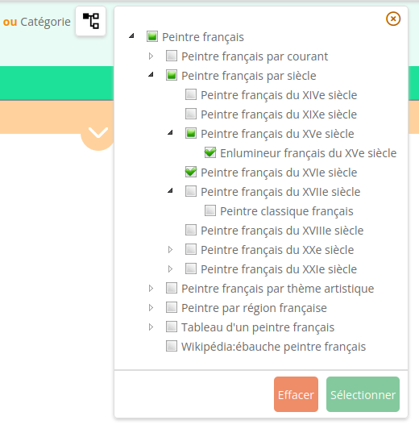

_[Home](index.html) > JSON-based configuration_

# Sparnatural JSON configuration

Sparnatural can be configured using a JSON(-LD) data structure. The data structure looks very much like [JSON-LD](https://www.w3.org/TR/json-ld/), but is really interpreted and parsed like a JSON, so stick with the JSON keys given below.

## Minimal JSON configuration

A minimal JSON configuration for Sparnatural looks like the following example. It declares 1 class `foaf:Person` and a single property `foaf:knows` that has `foaf:Person` as its domain and range (a Person can know another Person). The config is stored in a `config` javascript variable that will be passed as a parameter to init Sparnatural.

```javascript
    <script>
var config = 
{
  "@context":
  {
    "Ontology" : "http://www.w3.org/2002/07/owl#Ontology",
    "Class" : "http://www.w3.org/2002/07/owl#Class",
    "ObjectProperty" : "http://www.w3.org/2002/07/owl#ObjectProperty",
    "label": "http://www.w3.org/2000/01/rdf-schema#label",
    "domain": {
      "@id": "http://www.w3.org/2000/01/rdf-schema#domain",
      "@type": "@id"
    },
    "range": {
      "@id": "http://www.w3.org/2000/01/rdf-schema#range",
      "@type": "@id"
    },
    "unionOf": {
      "@id": "http://www.w3.org/2002/07/owl#unionOf",
      "@type": "@id"
    },
    "subPropertyOf": {
      "@id": "http://www.w3.org/2000/01/rdf-schema#subPropertyOf",
      "@type": "@id"
    },
    "faIcon": "http://data.sparna.fr/ontologies/sparnatural-config-core#faIcon",
    "sparqlString": "http://data.sparna.fr/ontologies/sparnatural-config-core#sparqlString",
    "sparnatural": "http://data.sparna.fr/ontologies/sparnatural-config-core#",
    "datasources": "http://data.sparna.fr/ontologies/sparnatural-config-datasources#",
    "Service": "http://www.w3.org/ns/sparql-service-description#Service"
  },
  "@graph": [
    {
      "@id" : "http://labs.sparna.fr/sparnatural-demo/onto",
      "@type" : "Ontology"
    },
    {
      "@id" : "http://xmlns.com/foaf/0.1/Person",
      "@type" : "Class",
      "label": [
        {"@value" : "Person","@language" : "en"},
        {"@value" : "Personne","@language" : "fr"}
      ],
      "faIcon":  "fas fa-user"
    },
    {
      "@id" : "http://xmlns.com/foaf/0.1/knows",
      "@type" : "ObjectProperty",
      "subPropertyOf" : "sparnatural:ListProperty",
      "label": [
        {"@value" : "knows","@language" : "en"},
        {"@value" : "connait","@language" : "fr"}
      ],
      "domain": "http://xmlns.com/foaf/0.1/Person",
      "range": "http://xmlns.com/foaf/0.1/Person",
      "datasource": "datasources:list_foafname_alpha"
    }
  ]
}
;
</script>
```
## @context

Copy-paste the `@context` key given in the minimal example and do not modify it. Keep it like this for your own configuration.

## Classes configuration

The configuration lists the types of entities that are searchable in Sparnatural. These types either map to real RDF resources, or are used to express search criterias on literal values.
```
{
    "@id" : "http://xmlns.com/foaf/0.1/Person",
    "@type" : "Class",
    "label": [
      {"@value" : "Person","@language" : "en"},
      {"@value" : "Personne","@language" : "fr"}
    ],
    "faIcon":  "fas fa-user"
}
```

|  Key  | Description | Mandatory/Optional |
| ----- | ----------- | ------------------ |
|  `@id`  | This is the URI of the class/type. It is either the URI of a class in the data graph to be queried, or a custom URI that is mapped to one or more other classes in the underlying data graph (using `sparqlString` key, see below) | Mandatory |
|  `@type`  | The type for a class is always set to `"@type": "Class"` | Mandatory |
|  `label`  | A class needs to be associated to labels, at least one, in the language you expect it to be displayed; each label must be associated to a language code | Mandatory |
|  `icon/faIcon` | One of the cool thing of Sparnatural is the ability to associate an icon to each class displayed. Icon is optional and if not provided, a blank placeholder is used instead. You can provide an icon either using an image or using a [FontAwesome](https://fontawesome.com/) icon code, which is highly recommended. Simply use the key "faIcon" and provide the code of the FA icon to be used, like `fas fa-user` for a user, or `fas fa-building` for a building. This requires that you integrate FontAwesome in the page where Sparnatural will be inserted| Optional |
|  `sparqlString`  | When generating the SPARQL query, Sparnatural inserts the URI (`@id`) of the property given in the configuration, unless you specify a replacement `sparqlString` that will be inserted instead of the URI in the SPARQL query. You need to make sure the provided replacement string does not violate SPARQL syntax. Typical values you can use are:<br>1. Mapping to a single class URI, giving the class URI between angle brackets: `"sparqlString" : "<http://xmlns.com/foaf/0.1/Person>"`<br> 2. Mapping to a class with an extra criteria separated by a semicolon: `"sparqlString" : "<http://www.w3.org/2004/02/skos/core#Concept>; <http://www.w3.org/2004/02/skos/core#inScheme> <http://mysite.com/vocabulary/TypesOfArtwork>"`| Optional |
[`order`](http://data.sparna.fr/ontologies/sparnatural-config-core#order) | Order of this class in classes lists. If not set, alphabetical order is used. | Optional |
[`tooltip`](http://data.sparna.fr/ontologies/sparnatural-config-core#tooltip) | Text that appears as tooltip when hovering this class, in lists and when selected. Multiple values are allowed in different languages. HTML markup is supported. | Optional|
[`defaultLabelProperty`](http://data.sparna.fr/ontologies/sparnatural-config-core#defaultLabelProperty) | Use this annotation to relate a class in a Sparnatural configuration to a property that will be used as the default to fetch the labels of instances of this class. When a user selects this class as a column in the result set, if the class has this annotation set, everything behaves as if the user had selected also the corresponding property to be included. The label property may have no domain specified if you don't want it to be proposed to the user. The property must have a range specified to a single class. | Optional |

## Object properties

Each property represents a possible connection between one or more classes declared in the configuration.

Example:
```
 {
      "@id" : "http://xmlns.com/foaf/0.1/knows",
      "@type" : "ObjectProperty",
      "subPropertyOf" : "sparnatural:ListProperty",
      "label": [
        {"@value" : "does not know","@language" : "en"},
        {"@value" : "ne connaît pas","@language" : "fr"}
      ],
      "domain": "http://xmlns.com/foaf/0.1/Person",
      "range": {
        "@type" : "Class",
        "unionOf" : {
          "@list" : [ 
            { "@id" : "http://dbpedia.org/ontology/Museum"},
            { "@id" : "http://dbpedia.org/ontology/Person"},
            { "@id" : "http://dbpedia.org/ontology/Artwork"}
          ]
        }
      },
      "sparqlString" : "^<http://xmlns.com/foaf/0.1/knows>",
      "tooltip": [
        {
          "@value": "If a person knows the other person.",
          "@language": "en",
        },
        {
          "@value": "Si une personne connaît l'autre personne.",
          "@language": "fr",
        },
      ],
      "datasource": {
        "datasources:list_foafname_alpha",
        "sparqlEndpointUrl" : "http://dbpedia.org/sparql"
      }
  }
```
|  Key  | Description | Mandatory/Optional |
| ----- | ----------- | ------------------ |
|  `@id`  | This value will be inserted inside the SPARQL query if no `"sparqlString":` property is defined   | Mandatory |
|  `@type`  | The type for a object property is always set to `"@type": "ObjectProperty"` | Mandatory |
|  `subPropertyOf`  |The key `subPropertyOf` for object properties defines the value selection for the range. It defines which widget should be used or if the value is a literal. More information in the [subPropertyOf table](#subPropertyOf-table)| Mandatory |
|  `label`  | Just like classes, properties need to have labels, at least one, always associated to a language code. | Mandatory |
|  `domain & range`  | Connects classes with each other. Can be specified with single value or `unionOf`. Example above shows single value for domain and `unionOf` for the range.   | Mandatory |
|  `propertyPath`  |  Similarly to classes, the URI ( `@id` ) of the property is inserted in the SPARQL query, unless you specify a replacement string (typically a property path) using `sparqlString`. A typical use-case for this is to provide inverse links to the user that are not explicit in the data graph.| Optional |
|  `datasource`  |  Some widgets such as `sparnatural:AutocompleteProperty` or `sparnatural:ListProperty` require a datasource. This datasource is actually SPARQL query which returns the necessary information needed by the widget. This can be achieved in many different ways and is thoroughly explained [here](OWL-based-configuration-datasources) | Optional |
| [`enableNegation`](http://data.sparna.fr/ontologies/sparnatural-config-core#enableNegation) |  Enables the additional option to express a negation (using a `FILTER NOT EXISTS`) on this property. The `FILTER NOT EXISTS` will apply to the whole "branch" in the query (this criteria and all children criterias) |
| [`enableOptional`](http://data.sparna.fr/ontologies/sparnatural-config-core#enableOptional) |  Enables the additional option to express an `OPTIONAL` on this property. The `OPTIONAL` will apply to the whole "branch" in the query (this criteria and all children criterias) |
| [`order`](http://data.sparna.fr/ontologies/sparnatural-config-core#order) |  Order of this property in property lists. If not set, alphabetical order is used. |
| [`tooltip`](http://data.sparna.fr/ontologies/sparnatural-config-core#tooltip) | Text that appears as tooltip when hovering this property, in lists and when selected. Multiple values are allowed in different languages. HTML markup is supported. |
| [`isMultilingual`](http://data.sparna.fr/ontologies/sparnatural-config-core#isMultilingual) | If set to `true` used to indicate that the values of the property are multilingual. A FILTER ( `FILTER((LANG(?Tree_1_label)) = "en")` )will automatically be added based on the language parameter when intiatilizing Sparnatural.  |
| [`sparqlService`](http://data.sparna.fr/ontologies/sparnatural-config-core#sparqlService) | This annotation allows to specify a remote endpoint for federated queries. The [`federated queries`](https://www.w3.org/TR/sparql11-federated-query/) works with the SERVICE keyword. This annotation must specify a [sd:Service](#annotation-for-service-keyword) endpoint. For example: <pre> { <br>&emsp; "@id":"http://data.mydomain.org/ontology/sparnatural-config#DBPediaService",<br>&emsp; "@type":"sd:Service",<br> &emsp;"endpoint": "https://dbpedia.org/sparql"<br>}</pre>

### subPropertyOf table

This table shows possible values for the subPropertyOf of properties (not classes!)

|  Value  | Description |
| -----   | ----------- |
|  rdfs:Literal  | For classes that correspond either to a Literal (typically a date), either to a search, set the class as subclass of rdfs:Literal. <br>1. No rdf:type criteria corresponding to this class will be put in SPARQL queries. <br> 2. The class will never appear in the initial class list <br>3. it will not be possible to traverse this class with WHERE clauses |
|  core:NotInstantiatedClass  | For classes that are references to "external" URIs that are not themselves described in the graph (i.e. they are not the subject of any triples in the graph, in particular no rdf:type), set the class as subclass of core:NotInstantiatedClass. 1. No rdf:type criteria corresponding to this class will be put in SPARQL queries 2. The class will never appear in the initial class list. It can still be used to be traversed in WHERE clause |
|  sparnatural:ListProperty  |   |
|  sparnatural:AutocompleteProperty  |   |
|  sparnatural:TreeProperty  |   |
|  sparnatural:TimeProperty-Date  |   |
|  sparnatural:MapProperty  |   |
|  sparnatural:TimeProperty-Year  |   |
|  sparnatural:SearchProperty  |   |
|  sparnatural:NonSelectableProperty  |  |
|  sparnatural:BooleanProperty  |  |

## Configure Datasources

Some widgets such as `sparnatural:AutocompleteProperty` and `sparnatural:ListProperty ` require a `datasource` key to populate respectively the list of values or the values proposed by autocompletion. Creating a datasource for a widget can be achieved in 4 ways:
1. A reference to a preconfigured datasource.
2. A reference to a preconfigured SPARQL query, plus a property URI to be injected in this query;
3. Your own SPARQL query;
4. Callback method provided in the JavaScript code;

### A reference to a preconfigured datasource
Sparnatural comes preconfigured with datasources that can populate lists based on `rdfs:label`, `skos:prefLabel`, `foaf:name`, `dcterms:title`, `schema:name` or the URI of the entity (which is the default behavior). For each of these properties, 3 flavors of datasource exist : either with an alphabetical ordering, an alphabetical ordering plus the count shown in parenthesis, or a descending count ordering.

|  queryTemplate  | property path | widget |
| --------------- | ------------- | ------ |
| `datasources:list_URI_alpha` | | `sparnatural:ListProperty` |
| `datasources:list_URI_count` |  | `sparnatural:ListProperty` |
| `datasources:list_rdfslabel_alpha` |`rdfs:label`  | `sparnatural:ListProperty` |
| `datasources:list_rdfslabel_count` | `rdfs:label` | `sparnatural:ListProperty` |
| `datasources:list_skospreflabel_alpha` | `skos:prefLabel` | `sparnatural:ListProperty` |
| `datasources:list_skospreflabel_count` | `skos:prefLabel` | `sparnatural:ListProperty` |
| `datasources:list_skospreflabel_alpha_with_count` | `skos:prefLabel` | `sparnatural:ListProperty` |
| `datasources:list_dctermstitle_alpha` | `dcterms:title` | `sparnatural:ListProperty` |
| `datasources:list_dctermstitle_count` | `dcterms:title` | `sparnatural:ListProperty` |
| `datasources:list_dctermstitle_alpha_with_count` | `dcterms:title` | `sparnatural:ListProperty` |
| `datasources:list_schemaname_alpha` | `schema:name` | `sparnatural:ListProperty` |
| `datasources:list_schemaname_count` | `schema:name` | `sparnatural:ListProperty` |
| `datasources:list_schemaname_alpha_with_count` | `schema:name` | `sparnatural:ListProperty` |
| `datasources:search_URI_contains` | `schema:name` | `sparnatural:AutocompleteProperty` |
| `datasources:search_rdfslabel_strstarts` | `schema:name` | `sparnatural:AutocompleteProperty` |
| `datasources:search_rdfslabel_contains` | `schema:name` | `sparnatural:AutocompleteProperty` |
| `datasources:search_rdfslabel_bifcontains` | `schema:name` | `sparnatural:AutocompleteProperty` |
| `datasources:search_foafname_strstarts` | `schema:name` | `sparnatural:AutocompleteProperty` |
| `datasources:search_foafname_contains` | `schema:name` | `sparnatural:AutocompleteProperty` |
| `datasources:search_foafname_bifcontains` | `schema:name` | `sparnatural:AutocompleteProperty` |
| `datasources:search_dctermstitle_strstarts` | `schema:name` | `sparnatural:AutocompleteProperty` |
| `datasources:search_dctermstitle_contains` | `schema:name` | `sparnatural:AutocompleteProperty` |
| `datasources:search_dctermstitle_bifcontains` | `schema:name` | `sparnatural:AutocompleteProperty` |
| `datasources:search_skospreflabel_strstarts` | `schema:name` | `sparnatural:AutocompleteProperty` |
| `datasources:search_skospreflabel_contains` | `schema:name` | `sparnatural:AutocompleteProperty` |
| `datasources:search_skospreflabel_bifcontains` | `schema:name` | `sparnatural:AutocompleteProperty` |
| `datasources:search_schemaname_strstarts` | `schema:name` | `sparnatural:AutocompleteProperty` |
| `datasources:search_schemaname_contains` | `schema:name` | `sparnatural:AutocompleteProperty` |
| `datasources:search_schemaname_bifcontains` | `schema:name` | `sparnatural:AutocompleteProperty` |


The queryTemplate for a `datasources:list_rdfslabel_alpha_with_count` looks like the following:
```
SELECT ?uri ?count (CONCAT(STR(?theLabel), ' (', STR(?count), ')') AS ?label)
WHERE {
{
  SELECT DISTINCT ?uri (COUNT(?domain) AS ?count)
  WHERE {
    ?domain a $domain .
    ?domain $property ?uri .
    FILTER(isIRI(?uri))
  }
  GROUP BY ?uri
}
?uri $labelPath ?theLabel .
FILTER(lang(?theLabel) = "" || lang(?theLabel) = $lang)
}
ORDER BY UCASE(?label)
LIMIT 500
```
Given: The selection is on domain `<http://dbpedia.org/ontology/Museum>` and we have chosen `datasources:list_rdfslabel_alpha_with_count` then this query will be transformed to the following (note: The inserted rdfs:label for the regex `$labelPath`):

```
PREFIX rdf: <http://www.w3.org/1999/02/22-rdf-syntax-ns#> 
PREFIX rdfs: <http://www.w3.org/2000/01/rdf-schema#> 
PREFIX xsd: <http://www.w3.org/2001/XMLSchema#> 
SELECT ?uri ?count (CONCAT(STR(?theLabel), ' (', STR(?count), ')') AS ?label)
WHERE {
{
  SELECT DISTINCT ?uri (COUNT(?domain) AS ?count)
  WHERE {
    ?domain a <http://dbpedia.org/ontology/Museum> .
    ?domain <http://dbpedia.org/ontology/country> ?uri .
    FILTER(isIRI(?uri))
  }
  GROUP BY ?uri
}
?uri <http://www.w3.org/2000/01/rdf-schema#label> ?theLabel .
FILTER(lang(?theLabel) = "" || lang(?theLabel) = 'fr')
}
ORDER BY UCASE(?label)
LIMIT 500
```

### Preconfigured datasources for a TreeProperty

Sparnatural comes preconfigured with datasources that can populate a tree selector with the roots and the children of each node.

#### Preconfigured datasources for the roots of a TreeProperty

These datasources are to be used with a [`treeRootsDatasource`](http://data.sparna.fr/ontologies/sparnatural-config-datasources#treeRootsDatasource) on a [`TreeProperty`](http://data.sparna.fr/ontologies/sparnatural-config-core#TreeProperty).

The preconfigured datasource identifiers for roots datasource on a TreeProperty are :

1. [`datasources:tree_root_skostopconcept`](http://data.sparna.fr/ontologies/sparnatural-config-datasources#tree_root_skostopconcept) : reads the roots of a SKOS ConceptScheme using `skos:hasTopConcept` or `^skos:topConceptOf`, assuming the URI of the Sparnatural class is equal to the URI of the ConceptScheme
1. [`datasources:tree_root_skostopconcept_with_count`](http://data.sparna.fr/ontologies/sparnatural-config-datasources#tree_root_skostopconcept_with_count) : same as previous, but returns the number of occurences of each node in parenthesis

#### Preconfigured datasources for the children of a TreeProperty

These datasources are to be used with a [`treeChildrenDatasource`](http://data.sparna.fr/ontologies/sparnatural-config-datasources#treeChildrenDatasource) on a [`TreeProperty`](http://data.sparna.fr/ontologies/sparnatural-config-core#TreeProperty).

The preconfigured datasource identifiers for children datasource on a TreeProperty are :

1. [`datasources:tree_children_skosnarrower`](http://data.sparna.fr/ontologies/sparnatural-config-datasources#tree_children_skosnarrower) : reads the children of a node using `skos:narrower` or `^skos:broader`
1. [`datasources:tree_children_skosnarrower_with_count`](http://data.sparna.fr/ontologies/sparnatural-config-datasources#tree_children_skosnarrower_with_count) : same as previous, but returns the number of occurences of each node in parenthesis


#### Reference to a preconfigured SPARQL query + a property

If the preconfigured datasources do not fit the data model to be queried, you have the ability to refer to the same SPARQL queries used by these datasources, but adjust the property to be searched or used as a label. To do so, the `datasource` key should hold:
1. a `queryTemplate` reference to one of the preconfigured SPARQL query template from table [A reference to a preconfigured datasource](#a-reference-to-a-preconfigured-datasource)
1. a `labelProperty` or `labelPath` specifying either the full URI of the labelling property to use or a SPARQL property path (using angle brackets) to use.

e.g. to create a list widget based on `http://foo.bar/label` ordered by count :

```
    {
      "@id" : "http://labs.sparna.fr/sparnatural-demo-dbpedia/onto#bornIn",
      ...
      "datasource": {
        "queryTemplate" : "datasources:query_list_label_count",
        "labelProperty" : "http://foo.bar/label"
      } 
    }
```

### Your own SPARQL query

You can provide your own SPARQL queries to populate lists or autocomplete suggestions. To do so, provide a `queryString` key to your `datasource` object, holding the SPARQL query that should be used to populate the list/autocomplete.

**The SPARQL query MUST return 2 variables : `?uri` and `?label`, populated anyway you like.**

In this SPARQL query, the following replacements will happen:
- `$domain`, if present, will be replaced by the URI of the domain class;
- `$range`, if present, will be replaced by the URI of the range class;
- `$property`, if present, will be replaced by the URI of the property;
- `$lang`, if present, will be replaced by the language Sparnatural is configured with;
- `$key`, if present, will be replaced by the searched key for autocomplete fields;

Take a look at the preconfigured SPARQL queries in the [Sparnatural datasources ontology](http://data.sparna.fr/ontologies/sparnatural-config-datasources) to get you started.


e.g. to create a list widget based on `http://foo.bar/label` and ordered by reverse-alphabetical :

```
    {
      "@id" : "http://labs.sparna.fr/sparnatural-demo-dbpedia/onto#bornIn",
      ...
      "datasource": {
        "queryString" : `
          SELECT DISTINCT ?uri ?label
          WHERE {
              ?domain a $domain .
              ?domain $property ?uri .
              ?uri <http://foo.bar/label> ?label .
              FILTER(lang(?label) = "" || lang(?label) = $lang)
          }
          ORDER BY DESC(?label)
        `
      } 
    }
```

#### Specifying the SPARQL service of a datasource

By default, a SPARQL datasource will be executed against the SPARQL endpoint given in the `defaultEndpoint` property of [Sparnatural configuration](Javascript-integration).

It is however possible to indicate a different SPARQL endpoint to which the query should be sent, by using the `sparqlEndpointUrl` key on the datasource object.

This is not possible for preconfigured datasources that are always executed on the default endpoint.

e.g. to populate a list with `rdfs:label`s fetched from DBPedia:

```
    {
      "@id" : "http://labs.sparna.fr/sparnatural-demo-dbpedia/onto#bornIn",
      ...
      "datasource": {
        "queryTemplate" : "datasources:query_search_label_strstarts",
        "labelProperty" : "http://www.w3.org/2000/01/rdf-schema#label",
        "sparqlEndpointUrl" : "http://dbpedia.org/sparql"
      } 
    }
```

Cool, isn't it ?

### Federated Queries
Sparnatural v.8 >= provides support for basic query federation.
In order to define a sparql endpoint, a sparql service has to be defined:
```
    {
      "@id":
        "http://data.mydomain.org/ontology/sparnatural-config#DBPediaService",
      "@type": "sd:Service",
      "endpoint": "https://dbpedia.org/sparql" ,
      "label": "DBPedia (english)"
    },
```
Such a service endpoint definition can then be referenced within an object property with the *sparqlService* property:
```
    {
      "@id":"http://twin-example/geneva#Location",
      "@type": "Class",
      "subClassOf": "http://www.w3.org/2000/01/rdf-schema#Literal",
      "sparqlService": "http://data.mydomain.org/ontology/sparnatural-config#DBPediaService",
      "label": [
        { "@value": "Location", "@language": "en" },
        { "@value": "Location", "@language": "fr" }
      ],
      "faIcon": "fas fa-map-marked-alt"
    },
```

### Literal properties

TODO
